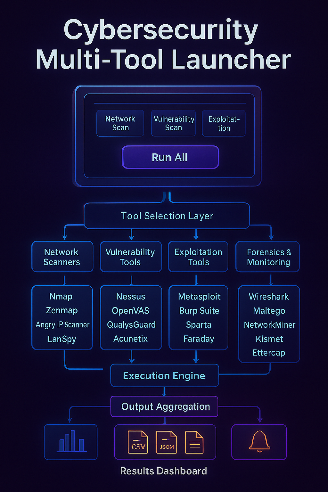

# 🚀CMTL ->  Cyber Security Multi-Tool Launcher  (Work in progress)

## One Command. All Tools. CLI & GUI Unified.....

---


## Mentors:-


---

 

 
---
  
  
  
  

---

## 🔥 About  
**CyberSec Multi Tool Launcher (CMTL)** is a unified **Python-based toolkit** that allows cybersecurity students, researchers, and penetration testers to **launch, manage, and capture results** from multiple security tools in one place & to save time and enhance workflow efficiency.  

It integrates both **external tools** (like Nmap, Metasploit, Burp Suite, Wireshark, OWASP ZAP, Magnet AXIOM, etc.) and **custom-built mini-tools** (like port scanner, ping sweep, banner grabber, packet sniffer, subdomain finder) into a single **CLI + GUI** launcher.  

---

## 📝 Problem Statement  
Cybersecurity professionals and students often face difficulty switching between different tools such as **Nmap, Wireshark, Nessus, Metasploit, and Burp Suite**.  
Each tool requires separate installation, command usage, and reporting, which makes workflow slow and inefficient.  

This project solves that by providing a **single GUI launcher** to run multiple tools and view outputs in one place.  

---


---

## 🎯 Objectives  
- Provide a **single launcher** for commonly used cybersecurity tools.  
- Reduce complexity by combining **network scanning, vulnerability assessment, pentesting, and forensic tools**.  
- Include **custom Python scanners** to demonstrate internal capabilities.  
- Allow **logging & reporting** in JSON + log files.  
- Support **cross-platform (Linux + Windows)** operation.   

---

## ⚙️ Functional Requirements  
1. Provide **GUI (Tkinter)** + **CLI menu** for tool selection.  
2. Allow **run-and-capture** for CLI tools.  
3. Support **launch-only mode** for GUI-based external tools.  
4. Provide **"Run All" option** sequentially.  
5. Store outputs in **logs/** and summary in **results.json**.  
6. Use a **config.json** file to manage tool paths, targets, and preferences.

---

## ⚡ Non-Functional Requirements  
- **Usability:** User-friendly CLI & GUI interface.  
- **Performance:** Must run tools quickly and handle sequential scans.  
- **Scalability:** Easy to add new tools via `config.json`.  
- **Portability:** Works on both Linux & Windows.  
- **Security:** Strictly for **ethical and academic research only**.  
- **Reliability:** Must not crash while multiple tools run.  
---

## 🌟 Features  
✅ CLI + GUI support  
✅ One-click tool launcher  
✅ "Run All" option (sequential)  
✅ Auto-install suggestions for missing tools (`apt`, `brew`, `choco`)  
✅ JSON reporting + log files  
✅ Cross-platform support  
✅ Mini-tools (Python-coded internal scanners)  


---
## External Tools Integrated:-
- **Network Scanners:** Nmap, Zenmap, Angry IP Scanner, Advanced IP Scanner, LanSpy  
- **Vulnerability Assessment:** OpenVAS, Nessus, QualysGuard, Acunetix  
- **Penetration Testing:** Metasploit, Burp Suite, Sparta, Faraday  
- **Forensics & Monitoring:** Wireshark, Maltego, NetworkMiner, Kismet, Ettercap  
- **Other Security Tools:** OWASP ZAP, Magnet AXIOM  

---
## 🎯 Expected Outcomes  
- **Centralized tool launcher** for multiple cybersecurity tools.  
- **Hands-on learning** for students in digital forensics and penetration testing.  
- **Automation of common tasks** like port scanning, subdomain enumeration, and packet sniffing.  
- **Cross-platform toolkit** usable in academic, lab, and training environments.  


---

## ✅ Installation & Usage

**Clone the Repository**
```bash
git clone https://github.com/isayani-78/CMTL.git
cd CMTL
python tool_launcher.py

```
# Default launcher (choose mode inside menu)
```
python tool_launcher.py
```

# CLI Mode
```
python tool_launcher.py --cli
```

# GUI Mode (Tkinter)
```
python tool_launcher.py --gui
```

# Run all tools sequentially
```
python tool_launcher.py --run-all
```
# 🔹Advanced Setup (Optional)
*For users who prefer virtual environments + requirements:-*
```
# Create virtual environment
python -m venv venv
source venv/bin/activate   # Linux/Mac
venv\Scripts\activate      # Windows

# Install dependencies
pip install -r requirements.txt
```
# 🔹 Configuring Tool Paths

*If tools are not in your system PATH, edit config.json:-*
```
{
  "default_target": "192.168.1.1",
  "tools": {
    "nmap": "nmap",
    "wireshark": "wireshark",
    "metasploit": "msfconsole"
  }
}
```
# 🔹 Outputs & Logs

*Combined summary → output/results.json*

*Individual logs → output/logs/*

---
# ❓ Troubleshooting:- 

*- Tool not found? → Make sure it’s installed and in PATH.*

*- Permission denied? → Use sudo (Linux/Mac) or run as Administrator (Windows).*

*- GUI not opening? → Ensure Python Tkinter is installed (built-in for most systems).*

*- Still stuck? → Delete output/ folder and rerun.*


---
**⚡ Tip:-**

*If a required external tool is missing, CMTL will prompt you to install it.*
*It supports auto-install for:-*
```
Linux: apt-get
Mac: brew
Windows: choco
```
## Internal Tools 

*⚠️ Ethics reminder:-*
*Only run these tools on hosts/networks you own or have explicit permission to test.*

*Run individually, e.g:-*
```
python tools/port_scanner.py 192.168.1.1
python tools/ping_sweeper.py 192.168.1 1 50
python tools/banner_grabber.py example.com 80
sudo python tools/packet_sniffer.py --count 20
python tools/subdomain_finder.py example.com
```
---
## 📂 Project Structure
```bash
cybersec-multi-tool-launcher/
│── tool_launcher.py          # Main launcher (CLI + GUI)
│── requirements.txt          # Python dependencies
│── config.json               # Configurable tool paths and targets
│── README.md                 # Documentation
│── tools/                    # Internal mini tools
│    ├── port_scanner.py
│    ├── ping_sweeper.py
│    ├── banner_grabber.py
│    ├── packet_sniffer.py
│    └── subdomain_finder.py
│── output/
│    ├── logs/                # Individual tool logs
│    └── results.json         # Combined scan results

```
---

## 🔒 Disclaimer

*⚠️ Use this tool only on systems/networks you own or have explicit permission to test.*

*Misuse may be illegal. The author is not responsible for misuse.*

